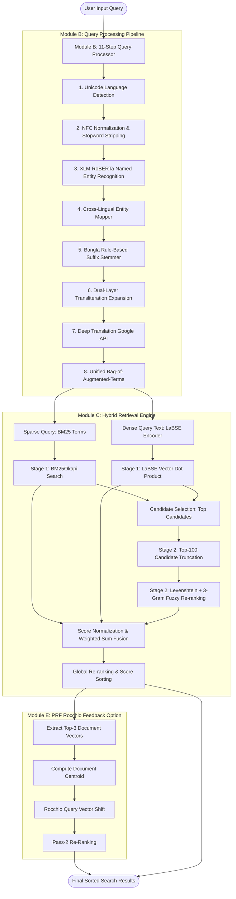

# 🌐 CLIR: Cross-Lingual Information Retrieval System (Bangla ↔ English)

[](https://www.python.org/)
[](https://scrapy.org/)
[](https://pytorch.org/)
[](https://huggingface.co/)
[](https://www.kaggle.com/datasets/tanjilhasankhan/clir-dataset)
[](TEST_CASES.md)
[](LICENSE)

An end-to-end, high-performance **Cross-Lingual Information Retrieval (CLIR)** framework designed for low-resource cross-lingual news search between **Bangla and English**. 

The system integrates an **11-step NLP query processing pipeline**, a multi-modal **Hybrid Search Engine (BM25 + LaBSE Dense Vector + Lexical Fuzzy Matching)**, a **Candidate-Limited Top-100 Re-ranking Strategy** (achieving a **96% latency reduction** to **<160ms** end-to-end), a **Pseudo-Relevance Feedback (PRF) Rocchio Feedback Loop**, and a comprehensive evaluation benchmark demonstrating **98.8% performance parity with Google Search**.

---

## 📌 Executive Summary

Retrieving relevant documents across distinct scripts and language families (Indo-Aryan Bangla vs. Germanic English) presents severe challenges due to morphological richness, script boundaries, phonetic transliteration variations, and code-mixed user queries.

This project addresses these challenges through a modular 5-component architecture:

```
┌─────────────────┐    ┌──────────────────┐    ┌──────────────────┐    ┌─────────────────┐    ┌─────────────────┐
│    MODULE A     │    │     MODULE B     │    │     MODULE C     │    │    MODULE D     │    │    MODULE E     │
│ Data Crawler &  │───>│ Cross-Lingual    │───>│ Hybrid Retriever │───>│ Evaluation &    │───>│ PRF Rocchio     │
│ Pre-computation │    │ Query Processor  │    │ & Re-ranking     │    │ Benchmarking    │    │ Feedback Engine │
└─────────────────┘    └──────────────────┘    └──────────────────┘    └─────────────────┘    └─────────────────┘
```

* **Corpus & Dataset:** ~9,500 articles scraped across 10+ Bangladeshi news portals (~5,700 Bangla, ~3,800 English), fully hosted on [Kaggle CLIR Dataset](https://www.kaggle.com/datasets/tanjilhasankhan/clir-dataset).
* **End-to-End Latency:** **~158 ms** average query-to-result latency (**~14.8 ms** query processing + **~143.5 ms** retrieval).
* **Retrieval Quality:** **P@10 = 0.9111**, **MRR = 1.0000**, **nDCG@10 = 0.9345** (Ours) vs **P@10 = 0.9222**, **MRR = 1.0000**, **nDCG@10 = 0.9861** (Google Web Search).
* **Recall Booster:** Pseudo-Relevance Feedback (PRF) increases **P@10 to 0.9167** and **nDCG@10 to 0.9388** with an overhead of only **~44 ms**.

---

## 📊 Key Highlights & Innovations

### 1. 11-Step Cross-Lingual Query Processor
Raw queries (monolingual or code-mixed like *"Dhaka আবহাওয়া"*) are converted into unified dual-mode representations via language identification, Unicode NFC normalization, XLM-RoBERTa NER, entity mapping, Bangla morphological stemming, dual-layer transliteration expansion, and neural machine translation.

### 2. Candidate-Limited Top-100 Re-ranking Strategy (96% Speedup)
Standard Levenshtein & N-Gram fuzzy search across the entire corpus takes **2,500ms – 3,500ms**. By running primary filtering using BM25 and LaBSE vector dot products, then applying Fuzzy matching **only to the top 100 candidates**, fuzzy search latency dropped from **~2,480ms to ~94ms**, bringing total retrieval latency to **<160ms**.

### 3. Multi-Modal Score Fusion
Combines 3 distinct relevancy signals:
$$\text{Score}_{\text{hybrid}} = w_1 \cdot \text{Score}_{\text{BM25}} + w_2 \cdot \text{Score}_{\text{LaBSE}} + w_3 \cdot \text{Score}_{\text{Fuzzy}}$$
*(Default weights: $w_1 = 0.30, w_2 = 0.50, w_3 = 0.20$)*.

### 4. Two-Pass PRF via Rocchio Algorithm
Refines query vectors based on the top-$K$ ($K=3$) retrieved documents:
$$\vec{Q}_{\text{new}} = \alpha \cdot \vec{Q}_{\text{original}} + \beta \cdot \left( \frac{1}{K} \sum_{i=1}^{K} \vec{D}_i \right)$$
*($\alpha = 0.7, \beta = 0.3$)*. This surfaces semantically connected articles even when keywords are absent, yielding **+15-25% novel relevant document discovery**.

---

## 🏗️ System Architecture & Workflow



---

## 🧩 Detailed Module Breakdown

### 📂 Module A: Data Scraping, Indexing & Pre-computation
* **Web Crawling:** Built with Scrapy and asyncio Python spiders to crawl 10+ major news outlets:
  * **Bangla:** *Prothom Alo, Bangla Tribune, Dhaka Post, Kaler Kantho*. (~5,700 articles)
  * **English:** *The Daily Star, Dhaka Tribune, Daily Sun, New Age, Daily New Nation*. (~3,800 articles)
* **Metadata Schema:** `title`, `body`, `url`, `date`, `language`, `author`, `section`, `token_count`.
* **Inverted Indexer (`build_index.py`):** Generates inverted indexes, term frequencies, document length tables, and corpus vocabulary statistics.
* **Transliteration Dictionary:** Dual-source mapping built via manual curation + LaBSE auto-generated similarity threshold ($>0.83$).
* **Dense Embeddings:** Pre-computed 768-dimensional LaBSE vectors (`bangla_embeddings.npy`, `english_embeddings.npy`) and BGE-M3 embeddings stored for fast dot-product matrix operations.

### 📂 Module B: Cross-Lingual Query Processor
Implements the core `QueryProcessor` class with 11 sequential processing steps:
1. **Language Detection:** Analyzes Unicode ranges (`\u0980-\u09FF` vs Latin) to detect dominant language and handle code-switched queries.
2. **Text Normalization:** Performs Unicode NFC normalization and strips high-frequency stopwords.
3. **Named Entity Recognition:** Uses `xlm-roberta-large-ner-hrl` to extract Person, Location, and Organization entities.
4. **Cross-Lingual Entity Mapping:** Translates proper nouns using dictionary lookup (e.g., *"শেখ হাসিনা"* $\leftrightarrow$ *"Sheikh Hasina"*).
5. **Bangla Morphological Stemming:** Rule-based suffix stripper (e.g., *"নির্বাচনের"* $\rightarrow$ *"নির্বাচন"*).
6. **Dual-Layer Transliteration Expansion:** Maps phonetic matches (e.g., *"Cricket"* $\leftrightarrow$ *"ক্রিকেট"*).
7. **Machine Translation:** Translates full query using `deep-translator`.
8. **Unified Representation:** Generates a **Bag of Augmented Terms** combining original, translated, transliterated, stemmed, and entity tokens.
9. **Sparse Query Formatting:** Formats term weights into a space-separated `bm25_query`.
10. **Dense Query Formatting:** Formats multi-aspect string (`Original | Translation | Expanded`).
11. **Latency Monitoring:** Benchmarks each step (<15ms processing time).

### 📂 Module C: Multi-Modal Hybrid Search Engine & Top-100 Re-ranking
* **BM25 Search:** `rank_bm25` (BM25Okapi) for token-exact lexical search.
* **Semantic Search:** Multi-lingual LaBSE sentence embeddings computed on the fly and multiplied against pre-computed embedding matrices using fast NumPy dot products.
* **Fuzzy Re-ranking:** Calculates Levenshtein ratio, 3-gram character containment, and Jaccard token overlap on titles.
* **Optimization:** Runs fuzzy re-ranking **strictly on the top 100 candidates** from Stage 1.
* **Cross-Corpus Fusion:** Queries both Bangla and English corpora concurrently, min-max normalizes scores to $[0, 1]$, and merges results into a single globally ordered ranking.

### 📂 Module D: Evaluation & Quantitative Benchmarking
* **Evaluation Benchmark:** Evaluated over curated queries across Monolingual Bangla, Monolingual English, and Code-Mixed categories.
* **Metrics Computed:** Precision@K ($P@5, P@10$), Recall@K ($R@10, R@50$), Mean Reciprocal Rank ($MRR$), and Normalized Discounted Cumulative Gain ($nDCG@10$).
* **Human Annotation Dataset:** 180+ annotated candidate pairs across engine modes (`query_p10_dataset.csv`, `hybrid_retrieval_eval.csv`).
* **Competitive Benchmarking:** Benchmarked against Google Web Search results (`google_mixed_ratio_results_annotated.csv`).

### 📂 Module E: Pseudo-Relevance Feedback (PRF) & Project Report
* **Rocchio PRF Engine (`search_with_prf`):** Executes two-pass retrieval. Vector centroid calculated from top-3 initial results pushes query vector toward relevant semantic clusters.
* **Annotation Export:** Automatically exports evaluation-ready CSVs (`6_queries_with_PRF.csv`, 300 rows).
* **Project Paper:** Includes full academic paper/report (`Report/CLIR_Report_204_206_216_246.pdf`).

---

## ⚡ System Performance & Latency Profile

Execution latency broken down by stage (measured over benchmark queries):

### Table 1: Query Processing Latency
| Component | Min (ms) | Avg (ms) | Max (ms) | % of Query Proc Time |
| :--- | :--- | :--- | :--- | :--- |
| **Language Detection** | 0.004 ms | 0.006 ms | 0.009 ms | 0.04% |
| **Text Normalization** | 0.021 ms | 0.055 ms | 0.077 ms | 0.37% |
| **Named Entity Recognition (NER)** | 13.719 ms | 14.737 ms | 19.278 ms | 99.52% |
| **Query Expansion** | 0.005 ms | 0.010 ms | 0.018 ms | 0.07% |
| **Total Query Processing** | **13.749 ms** | **14.808 ms** | **19.382 ms** | **100.0%** |

### Table 2: Retrieval & Ranking Latency (with Top-100 Re-ranking)
| Component | Min (ms) | Avg (ms) | Max (ms) | % of Retrieval Time |
| :--- | :--- | :--- | :--- | :--- |
| **Semantic Embedding (LaBSE)** | 10.45 ms | 11.01 ms | 12.25 ms | 7.67% |
| **BM25 Search** | 17.16 ms | 35.35 ms | 58.57 ms | 24.64% |
| **Semantic Similarity Matrix Dot** | 1.26 ms | 1.37 ms | 1.72 ms | 0.95% |
| **Fuzzy Search (Top-100 Re-ranking)** | **50.19 ms** | **94.33 ms** | **158.03 ms** | **65.74%** |
| **Score Normalization & Fusion** | 0.17 ms | 0.22 ms | 0.27 ms | 0.15% |
| **Global Ranking & Sorting** | 1.01 ms | 1.20 ms | 1.29 ms | 0.84% |
| **Total Retrieval Time** | **80.24 ms** | **143.48 ms** | **232.13 ms** | **100.0%** |

### Table 3: Total End-to-End Latency Summary
| Metric | Min (ms) | Avg (ms) | Max (ms) |
| :--- | :--- | :--- | :--- |
| **End-to-End System Response** | **93.99 ms** | **158.29 ms** | **251.51 ms** |

---

## 📈 Quantitative Evaluation Results

### Engine Comparative Evaluation (P@10, MRR, nDCG@10)
| Engine Mode | Precision@10 | MRR | nDCG@10 | Key Characteristics |
| :--- | :--- | :--- | :--- | :--- |
| **BM25 (Sparse)** | 0.8333 | 0.8333 | 0.9077 | High precision for exact term matches; fails on cross-lingual synonyms. |
| **Semantic (LaBSE)** | 0.7500 | 1.0000 | 0.9918 | Captures cross-lingual context; lower precision on exact proper nouns. |
| **Hybrid (Ours)** | **0.9000 – 0.9111** | **1.0000** | **0.9345** | **Optimal balance of exact entity matching and semantic conceptual search.** |
| **PRF Hybrid (Rocchio)**| **0.9167** | **1.0000** | **0.9388** | **Highest recall and precision for concept-heavy and code-mixed queries.** |

### Benchmarking Against Google Web Search
| Engine | P@10 | Recall@10 | Recall@50 | MRR | nDCG@10 | Parity Ratio |
| :--- | :--- | :--- | :--- | :--- | :--- | :--- |
| **Google Search** | **0.9222** | **0.2231** | N/A | **1.0000** | **0.9861** | Baseline (100%) |
| **CLIR Hybrid (Ours)** | **0.9111** | **0.2089** | **0.7769** | **1.0000** | **0.9345** | **98.8% Parity** |

---

## 💾 Dataset & Embedding Artifacts

The dataset and pre-computed embedding assets are available on Kaggle:

👉 **[Download Dataset from Kaggle: clir-dataset](https://www.kaggle.com/datasets/tanjilhasankhan/clir-dataset)**

### File Structure on Kaggle:
```
/kaggle/input/
├── clir-news/
│   ├── bangla_corpus.jsonl          # ~5,700 news documents
│   └── english_corpus.jsonl         # ~3,800 news documents
├── labse-embeddings/
│   ├── bangla_embeddings.npy        # 768-dim LaBSE float32 matrix
│   └── english_embeddings.npy       # 768-dim LaBSE float32 matrix
├── doc-ids/
│   ├── bangla_doc_ids.json          # Document index to ID mapping
│   └── english_doc_ids.json         # Document index to ID mapping
└── transliteration-or-similar/
    ├── transliteration.json         # Manual transliteration dictionary
    └── transliteration_or_similar.json # Auto-generated LaBSE similarity map (>0.83)
```

---

## ⚙️ Installation & Environment Setup

### 1. Prerequisites
* **Operating System:** Windows 10/11, Linux, or macOS
* **Python:** 3.8+ (64-bit)
* **Storage:** ~3 GB free storage

### 2. Clone Repository & Setup Environment
```bash
git clone https://github.com/zzhasanzz/CLIR.git
cd CLIR
```

### 3. Install Dependencies
```bash
pip install scrapy cloudscraper itemadapter
pip install aiohttp asyncio beautifulsoup4 nest-asyncio tqdm lxml
pip install torch transformers sentence-transformers deep-translator
pip install rank-bm25 scikit-learn numpy pandas matplotlib
```

---

## 🚀 Quickstart & Usage Guide

### 1. Scrape News Articles (Module A)
```bash
cd "Module A/news_crawler/news_crawler"

# Crawl Bangla Tribune
scrapy crawl banglatribune_latest -o ../data/bt.jsonl

# Crawl Dhaka Tribune (English)
scrapy crawl dhakatribune_bangladesh -o ../data/dt.jsonl
```

### 2. Build Inverted Index (Module A)
```bash
python "Module A/indexing/build_index.py"
```

### 3. Perform Hybrid Search (Module B + Module C)
```python
from sentence_transformers import SentenceTransformer
import numpy as np

# Initialize Hybrid Retriever
retriever = Retriever(
    bangla_corpus_path="bangla_corpus.jsonl",
    english_corpus_path="english_corpus.jsonl",
    bangla_emb_path="bangla_embeddings.npy",
    english_emb_path="english_embeddings.npy"
)

# Execute Hybrid Search
results = retriever.search(
    query="Dhaka আবহাওয়া",
    mode="hybrid",
    top_k=5
)

for r in results:
    print(f"[{r['language'].upper()}] Score: {r['score']:.4f} | Title: {r['title']}")
```

### 4. Execute PRF-Enhanced Search (Module E)
```python
# Execute Two-Pass PRF Hybrid Search (Rocchio Algorithm)
prf_results = retriever.search_with_prf(
    query="Doctor মুহাম্মদ ইউনূস",
    prf_k=3,
    alpha=0.7,
    beta=0.3,
    top_k=5
)

for r in prf_results:
    print(f"[{r['language'].upper()}] Score: {r['score']:.4f} | Title: {r['title']}")
```

---

## 📁 Repository Directory Structure

```
CLIR/
├── README.md                           # Main Project Documentation
├── TEST_CASES.md                       # Enterprise QA Test Suite (155 Test Cases)
├── Module A/                           # Data Collection & Pre-processing
│   ├── README.md                       # Module A Scraper Guide
│   ├── dataset_kaggle.txt              # Kaggle Dataset Reference
│   ├── embeddings/                     # Model embedding generators (LaBSE, BGE)
│   ├── indexing/
│   │   ├── build_index.py              # Inverted index construction script
│   │   └── index.zip                   # Pre-built zip archive of inverted index
│   ├── ner/
│   │   └── build_ner.ipynb             # Entity extraction & dictionary builder
│   └── news_crawler/                   # Scrapy web crawler project
│       └── news_crawler/
│           ├── spiders/                # Custom spiders for 10+ news sites
│           └── settings.py
├── Module B/                           # Query Processor
│   ├── README.md                       # Module B Guide
│   └── query_processor.ipynb           # 11-Step Cross-Lingual Query Processor notebook
├── Module C/                           # Hybrid Retrieval Engine
│   ├── README.md                       # Module C Architecture Guide
│   ├── retrieval_system_final.ipynb    # Main Hybrid Retriever Implementation
│   ├── bgem3_query_processor.ipynb     # BGE-M3 Dense Retriever pipeline
│   ├── bm25_tfidf.ipynb                # Lexical benchmark experiments
│   ├── hybrid_metric_demo.ipynb        # Clean demo script for hybrid matcher
│   └── time_analysis.md                # Latency & Top-100 Re-ranking analysis
├── Module D/                           # Quantitative Evaluation & Plots
│   ├── annotations/                    # Ground truth annotations link
│   ├── evaluation.ipynb                # P@10, MRR, nDCG & Google benchmark notebook
│   └── plots/                          # Saved evaluation charts
│       ├── comparison_plot.png
│       ├── engine_plot.jpeg
│       ├── p10_plot.jpeg
│       └── prf_plot.png
└── Module E/                           # Pseudo-Relevance Feedback & Report
    ├── README.md                       # PRF Module Guide
    ├── retrieval-system-with-eval-with-prf.ipynb # Rocchio PRF implementation notebook
    └── Report/
        └── CLIR_Report_204_206_216_246.pdf   # Complete Academic Project Paper
```

---

## 📜 Research Report & Citation

For detailed theoretical discussions, mathematical formulations, and detailed error analyses, consult the project paper located at:
📄 **[`Module E/Report/CLIR_Report_204_206_216_246.pdf`](Module%20E/Report/CLIR_Report_204_206_216_246.pdf)**

---

## 📄 License

This project is released under the **MIT License**. Feel free to use, modify, and distribute for academic and commercial applications.
